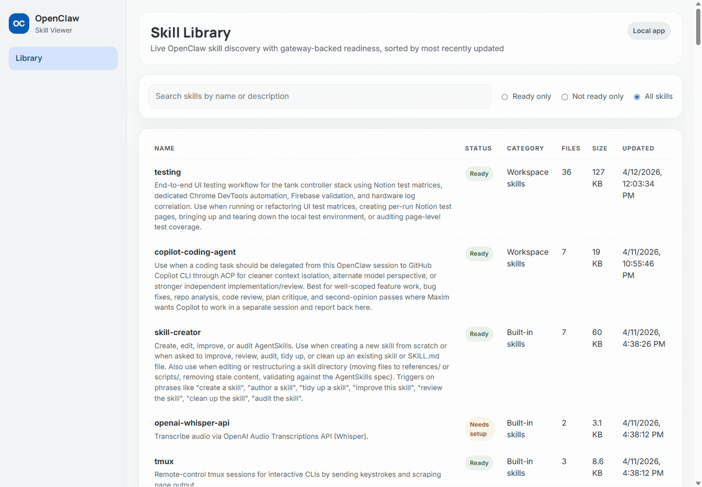

# OpenClaw Skill Viewer

A **local-first OpenClaw skills dashboard** for browsing OpenClaw skills, checking which ones are actually ready to use, and inspecting skill contents without digging through multiple filesystem roots.



## Why this exists

OpenClaw skills often live across multiple roots:
- bundled with OpenClaw
- workspace-local
- personal / custom skill folders

That is fine for power users, but it gets annoying fast when you want to answer simple questions like:
- Which skills are available right now?
- Which ones are ready vs still missing setup?
- Where did this skill come from?
- What is inside this skill folder?

This project gives that workflow a fast local UI instead of making you spelunk through directories and `SKILL.md` files by hand.

If you have ever searched for something like:
- **OpenClaw skills dashboard**
- **how to view OpenClaw skills**
- **browse OpenClaw skills in a web UI**
- **see which OpenClaw skills need setup**

that is exactly the problem this repo is trying to solve.

## What it does

- discovers skills from multiple local roots
- shows **readiness** using local OpenClaw gateway skill status
- filters by **Ready only**, **Not ready only**, or **All skills**
- sorts the library by most recently updated skill folders
- opens a skill detail page with a file tree and default `SKILL.md`
- renders markdown nicely and supports raw source view
- refreshes automatically when local skill files change

## What it intentionally does **not** do

- edit skill files
- publish or sync skills anywhere
- act as a hosted multi-user service
- replace OpenClaw itself

This is a **viewer**, not a skill-management platform.

## Requirements

- Node.js 24+
- `openclaw` CLI available on `PATH`
- local filesystem access to the skill roots you want to browse

## Quick start

```bash
git clone https://github.com/GanglyPuma22/openclaw-skill-viewer.git
cd openclaw-skill-viewer
npm install
npm run build
npm run start
```

Then open:

- `http://127.0.0.1:4174`

## Development

```bash
npm install
npm run dev
```

Useful scripts:

```bash
npm run dev     # Vite client + API server
npm run build   # typecheck + production build
npm run lint    # eslint
npm run start   # serve the built app on http://127.0.0.1:4174
```

## Configuration

By default the app reads these skill roots:

- built-in: `~/.nvm/versions/node/<current-node-version>/lib/node_modules/openclaw/skills`
- workspace: `~/.openclaw/workspace/skills`
- other: `~/.agents/skills`

You can override them with environment variables:

```bash
export OPENCLAW_SKILL_VIEWER_BUILTIN_ROOT="$HOME/.nvm/versions/node/<current-node-version>/lib/node_modules/openclaw/skills"
export OPENCLAW_SKILL_VIEWER_WORKSPACE_ROOT="$HOME/.openclaw/workspace/skills"
export OPENCLAW_SKILL_VIEWER_OTHER_ROOT="$HOME/.agents/skills"
```

Example:

```bash
OPENCLAW_SKILL_VIEWER_WORKSPACE_ROOT="$HOME/some-other-workspace/skills" npm run start
```

## Runtime API

The UI and API are served from the same origin.

- `GET /api/health`
- `GET /api/skills`
- `GET /api/skills/:skillId`
- `GET /api/skills/:skillId/file`
- `GET /api/events`

## FAQ / common use cases

### How do I view OpenClaw skills in a dashboard?
Run this project locally. It scans your OpenClaw skill roots, shows them in a table, and lets you click into each skill to inspect its files and `SKILL.md`.

### How do I see which OpenClaw skills are ready vs still missing setup?
The library includes readiness filters for:
- **Ready only**
- **Not ready only**
- **All skills**

Readiness comes from the local `openclaw skills list --json` status output.

### Can it show bundled, workspace, and custom skills together?
Yes. By default it reads built-in, workspace, and custom/personal skill roots and shows them in one dashboard.

## Current limitations

- The app is optimized for **local** OpenClaw installs, not remote multi-user deployment.
- Readiness depends on local `openclaw skills list --json` output, so if the CLI is unavailable or unhealthy the readiness layer will degrade.
- Built-in skill auto-discovery still assumes a typical user-level OpenClaw install layout unless you override the built-in root explicitly.
- Browser automation used during development/testing can be a little WSL-specific; the app itself does not require that setup for normal use.

## Tech stack

- React + TypeScript + Vite
- Express + TypeScript
- chokidar for live refresh
- gray-matter + markdown-it for skill docs rendering

## OSS release notes

This repo is intentionally released as a small, sharp local tool.

If you are looking for a full skill registry, editor, or hosted dashboard, this is not that. If you want a fast way to inspect OpenClaw skills on your own machine, it is.

## License

MIT — see [LICENSE](LICENSE).
